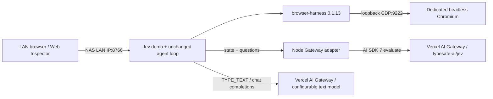

# UGREEN NAS deployment

## Architecture



Two Compose services: `jev` contains Python, browser-harness and Chromium; `gateway-adapter`
contains only the official evaluation SDK and protocol conversion. Keeping Chrome in Jev's
network namespace avoids Chromium loopback binding / WebSocket discovery address problems.
There is no CDP proxy, cloud browser, host Chrome, database, or change to the agent loop.
Only port 8766 is published, explicitly on `NAS_LAN_IP`. CDP stays at 127.0.0.1:9222 inside
Jev's container. The adapter has no published port. The private Docker bridge permits outbound
internet access: an `internal: true` bridge alone would prevent visiting websites and Gateway.

`JEV_PROVIDER=vercel` never falls back to direct TypeSafe. An operator can explicitly choose
`typesafe`, which uses `TYPESAFE_API_KEY` and `TYPESAFE_MODEL`; TYPE_TEXT remains independently
configured. Python's unset-provider default stays `typesafe` for upstream library compatibility;
the provided Compose environment explicitly selects `vercel`.

The SDK accepts the upstream structured state, criteria and instructions directly. Its choice
answer omits `confidence`: the adapter sets it to `probabilities[choice]`. Missing probabilities
are not fabricated; Python's unchanged `validate_choice()` rejects them before execution.
The SDK also validates all returned heads; this can reject an invalid unused head earlier than
upstream's selected-head validation. No alternative head is executed. SDK retries are disabled;
Python retains its bounded provider retries, never retries browser mutations.

## Configuration and launch

Verified target on 2026-09-19: `QuiteStar`, `uname -m = aarch64`, Compose v5.1.3.
All base images support ARM64 and AMD64; Debian supplies native Chromium for both.
Do not set `platform: linux/amd64` on the ARM NAS.

```sh
cd /volume4/Docker/jev-ultrafast
# .env has already been prepared here, with blank credentials and this NAS's LAN address.
# On another installation: cp .env.example .env && chmod 600 .env
# Edit .env locally; never paste credentials into an issue or commit them.
# AI_GATEWAY_API_KEY=<your key>
# NAS_LAN_IP=192.168.50.115
# JEV_PUBLIC_ORIGIN=http://192.168.50.115:8766
sudo docker compose config --quiet
sudo docker compose up -d --build --wait --wait-timeout 180
sudo docker compose ps
```

Open `http://192.168.50.115:8766`, choose Wikipedia, and run automatically.
For other tasks enter an optional starting HTTP(S) URL and your goal. Embedded URL credentials are rejected.
That is the intended address, not a claim that deployment has passed acceptance.
The Inspector keeps upstream's random per-process token and exact Host/Origin checks.
It is a trusted-LAN demo, not multi-user authentication: any client allowed to open the page
can obtain the token and operate the browser. Do not publish it on the internet.
Restart refreshes the token; reload the Inspector afterwards.

Fill `AI_GATEWAY_API_KEY` once. `TEXT_MODEL_API_KEY` overrides it only when intentionally set.
Default helper: `openai/gpt-5.4-nano`, `reasoning_effort=none`, JSON object response.
Change `TEXT_MODEL` for another verified Gateway model. Set its supported reasoning effort.
Non-Gateway endpoints retain the original helper's compatibility behavior.
`TYPESAFE_DEMO_PORT=8766`, the published port, and `JEV_PUBLIC_ORIGIN` must stay consistent.

### Docker secrets instead of environment keys

The Python and Node readers support `AI_GATEWAY_API_KEY_FILE`. Python additionally supports
`TEXT_MODEL_API_KEY_FILE` and `TYPESAFE_API_KEY_FILE`. Leave the corresponding direct value
blank. Supply a root/operator-managed secret outside the repository and mount it read-only
into both services. A Compose override example:

```yaml
services:
  jev:
    secrets: [gateway_key]
    environment:
      AI_GATEWAY_API_KEY_FILE: /run/secrets/gateway_key
  gateway-adapter:
    secrets: [gateway_key]
    environment:
      AI_GATEWAY_API_KEY_FILE: /run/secrets/gateway_key
secrets:
  gateway_key:
    file: /absolute/operator-managed/path/gateway_key
```

Do not store keys inside Chrome/harness/artifact volumes. These volumes can contain cookies
and task content and must remain private. `.env`, profiles, raw artifacts and secret directories
are ignored by Git and excluded from Docker contexts. Avoid `docker compose config` without
`--quiet` when sharing output, because it expands environment secrets.

## Persistence and recovery

- `chrome-profile` owns `/data/chrome` (dedicated automation profile).
- `harness-state` owns `/data/harness`; transient daemon sockets live in `/tmp/harness-runtime`.
- `artifacts` owns `/app/artifacts`; recording is opt-in and harness auto-recording is disabled.
- Both services use `restart: unless-stopped` and bounded JSON log rotation.
- Chromium has 1 GiB shared memory. A small supervisor terminates the whole Jev/Chrome unit
  if either process exits or CDP/UI probes fail three consecutive times after startup grace.
  Compose then restarts it. Active tasks are intentionally not replayed; start a fresh task.
- A healthcheck becoming unhealthy alone does not cause Docker to restart a container;
  the Jev supervisor supplies that recovery behavior. Adapter recovery covers process crashes;
  upstream Gateway outages are surfaced as task errors, never direct-provider fallback.
- Do not scale this stack or attach two browsers to the same Chrome profile volume.

Chromium runs as an unprivileged user with `--no-sandbox` for Docker/NAS compatibility.
This disables Chromium's own sandbox; Docker is the remaining isolation boundary. The container
has no privileged mode, Docker socket, or NAS bind mounts. This is a material limitation for
untrusted websites. Chrome's child process environment is stripped of key/token variables,
but this is not a separate security boundary from Python in the same container.

## Acceptance (run on NAS after Docker access and key are available)

```sh
sudo docker compose ps
sudo docker compose exec -T jev python docker/healthcheck.py
sudo docker compose exec -T jev browser-harness --doctor
sudo docker compose exec -T jev python scripts/verify_wikipedia.py
sudo docker compose restart
sudo docker compose up -d --wait --wait-timeout 180
sudo docker compose exec -T jev browser-harness --doctor
sudo docker compose exec -T jev python scripts/verify_wikipedia.py
```

The CDP probe checks `http://127.0.0.1:9222/json/version` from inside Jev, not
`http://chromium:9222`: this deployment deliberately uses a shared container.
`verify_wikipedia.py` gives only the natural-language goal, then independently checks the real
page's h1 and URL. It does not use a site-specific action plan or treat DONE as proof.
These commands make paid API calls. Ordinary pytest and Node tests remain offline.

In Gateway Logs filter by `app:jev-ultrafast`, `host:nas` and separately
`component:decision` / `component:type-text`. Verify model `typesafe-ai/jev` on decision rows
and the configured text model on helper rows. Container logs only record component, model,
status and token usage; they are not substitute proof for Gateway's logs.
If the agent reaches the article without TYPE_TEXT, that run does not prove helper routing;
use a task requiring entry into Wikipedia's search field and verify an actual TYPE_TEXT event.
Gateway's Custom Reporting API can query the same tags with the Gateway key, subject to plan
availability, additional reporting charges and a processing delay. Static tags include no
usernames, page text or credentials. Do not enable full prompt logging just to prove routing.

## Updates and rollback

Local development checkout uses `origin` = personal fork, `upstream` = official repository.
The NAS directory currently contains a deployment copy, not a second independent fork.
Push the reviewed branch, then use a clone on NAS or copy only tracked files from the chosen
commit. Never overwrite its `.env` or delete named volumes during an update.

```sh
git switch nas-gateway
git fetch upstream
git merge upstream/main
uv sync --frozen
uv run ruff check .
uv run pytest
node --check jev_ultrafast/static/app.js
uv build
npm --prefix gateway-adapter ci
npm --prefix gateway-adapter test
git push origin nas-gateway
```

Before rebuilding tag both current images with an explicit release ID and take a private,
consistent volume backup if persistence matters. Set `JEV_IMAGE_TAG=<release-id>` in `.env`
for every release. After update repeat the full acceptance sequence, including restart.
For rollback restore the prior tracked code/configuration, preserve `.env`, set its previous
`JEV_IMAGE_TAG`, then `sudo docker compose up -d --no-build --wait`. This requires retaining
both prior images. Do not use `down -v`, overwrite Git history, or automatically merge upstream
on a timer. Dependency versions are locked; browser security updates require an intentional
image rebuild and acceptance test. “Self-maintenance” here means bounded recovery, persistent
state, log rotation, and an explicit reproducible upgrade path, not unattended code changes.

## Current validation record — 2026-09-19

- Fork creation and remote setup succeeded; core `agent.py`, `browser.py`, `snapshot.js`,
  `questions.py` are unchanged.
- Ruff, 40 offline Python tests, 4 Node tests, JavaScript syntax checks and Python packaging passed.
- Python/Node registry manifests and uv manifest confirm ARM64 + AMD64 availability; Debian
  lists Chromium for both architectures. This is architecture evidence, not a successful image build.
- NAS SSH, ARM64 architecture and Compose configuration parsing passed.
- NAS Docker socket access failed; `sudo -n docker` requires a password. No containers were
  started. `compose ps`, container doctor, LAN runtime UI, Wikipedia, Gateway logs, and restart
  acceptance are **not verified**. The Dockerfile has not been built on this NAS.
- NAS direct Docker Hub manifest access timed out; GHCR manifest access succeeded.
  Restore NAS Docker Hub/proxy access before building. No unrelated NAS proxy settings changed.
- Gateway key is still required. The prepared `.env` contains no credentials.
